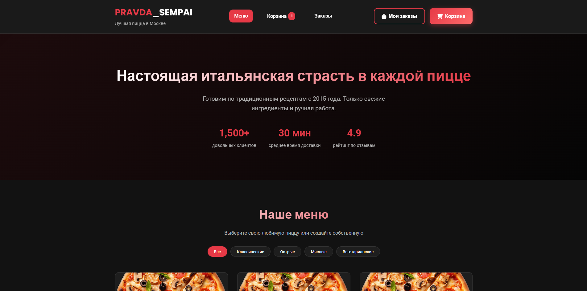
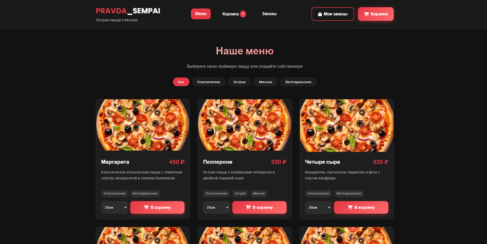
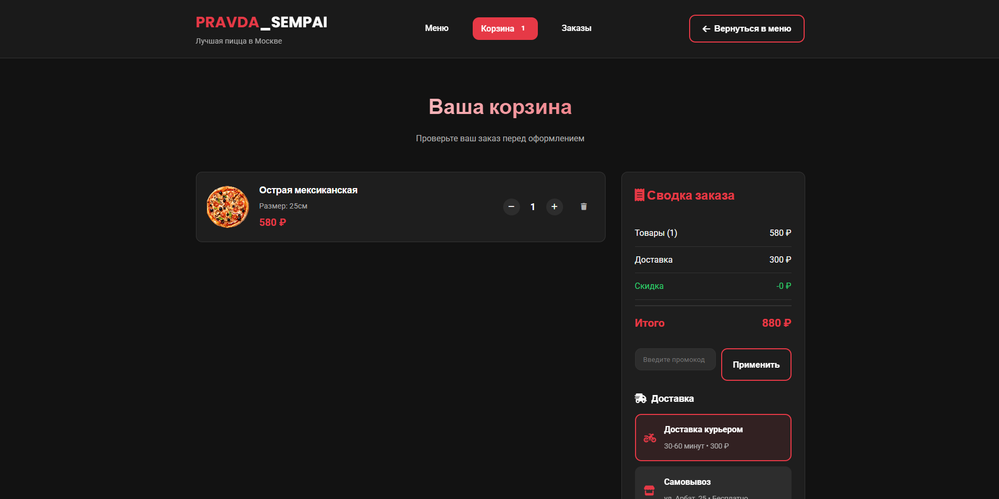
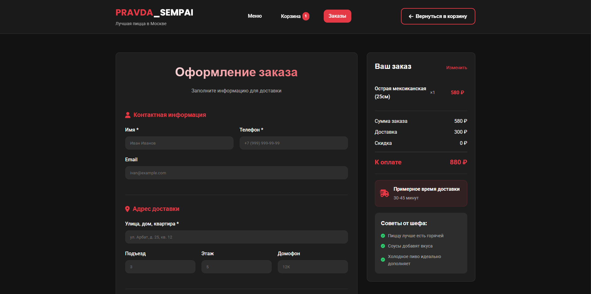

# 🍕 PRAVDA_SEMPAI Pizza Shop

**Полноценное веб-приложение для пиццерии с фронтендом и бэкендом**

[](https://python.org)
[](https://fastapi.tiangolo.com)
[](https://sqlalchemy.org)
[](https://developer.mozilla.org/HTML)
[](https://developer.mozilla.org/CSS)
[](https://developer.mozilla.org/JavaScript)

## 📋 О проекте

PRAVDA_SEMPAI Pizza Shop — это полный цикл веб-приложения для пиццерии, включающий:
- **Красивый адаптивный фронтенд** для клиентов
- **Мощный REST API** на FastAPI
- **Базу данных** SQLite/PostgreSQL с ORM
- **Корзину покупок** с localStorage

## ✨ Возможности

### 🛒 Для клиентов
- 📱 Полностью адаптивный дизайн (мобильные и десктоп устройства)
- 🍕 Интерактивное меню с фильтрацией по категориям
- 🛒 Корзина с добавлением/удалением товаров
- 📝 Форма оформления заказа с валидацией
- 💳 Выбор способа оплаты (наличные, карта, Apple Pay)
- 🕐 Выбор времени доставки
- 🔔 Система уведомлений
- 🏷️ Промокоды и скидки

### 🔧 Технические возможности
- 🔐 CORS настройки для безопасности
- 📚 Автоматическая документация API (Swagger/ReDoc)
- 🗄️ Миграции базы данных
- 🧪 Валидация данных через Pydantic
- 🔍 Фильтрация и пагинация
- 🐳 Готов к контейнеризации

## 📸 Скриншоты

### Главная страница с меню


*Адаптивное меню с фильтрацией по категориям*

### Корзина покупок

*Интерактивная корзина с изменением количества и промокодами*

### Оформление заказа

*Форма заказа с выбором времени доставки и оплаты*

## 🛠️ Технологический стек

### **Backend** (Python)
- **FastAPI** — современный, быстрый веб-фреймворк
- **SQLAlchemy** — ORM для работы с базой данных
- **Pydantic** — валидация данных и схемы
- **Uvicorn** — ASGI сервер
- **Alembic** (опционально) — миграции базы данных

### **Frontend**
- **HTML5** — семантическая разметка
- **CSS3** — адаптивная верстка, Flexbox/Grid
- **Vanilla JavaScript** — без фреймворков
- **Font Awesome** — иконки
- **Google Fonts** — типографика

### **База данных**
- **SQLite** — для разработки (включена)
- **PostgreSQL** — готовность к продакшену

### **Инструменты разработки**
- **Git** — контроль версий
- **Virtualenv** — изоляция зависимостей
- **HTTPie/Postman** — тестирование API

## 🚀 Установка и запуск

### Требования
- Python 3.8+
- pip (менеджер пакетов Python)

### Установка зависимостей
```bash
pip install -r backend/requirements.txt
```

### Запуск приложения
```bash
# Запуск сервера
python run.py

# Или напрямую через uvicorn
uvicorn backend.app.main:app --reload --host 0.0.0.0 --port 8000
```

### Открытие в браузере
- 📱 Фронтенд: http://localhost:8000
- 📚 Документация API: http://localhost:8000/api/docs
- 📖 ReDoc: http://localhost:8000/api/redoc
- 🩺 Проверка здоровья: http://localhost:8000/api/health

## 📱 Соцсети
[[YouTube](https://www.youtube.com/@pravda_sempai)
[[Rutube](https://rutube.ru/channel/41737058/)
[[VK](https://vk.com/pravdasempai)
[[Telegram](https://t.me/PRAVDASEMPAI)
